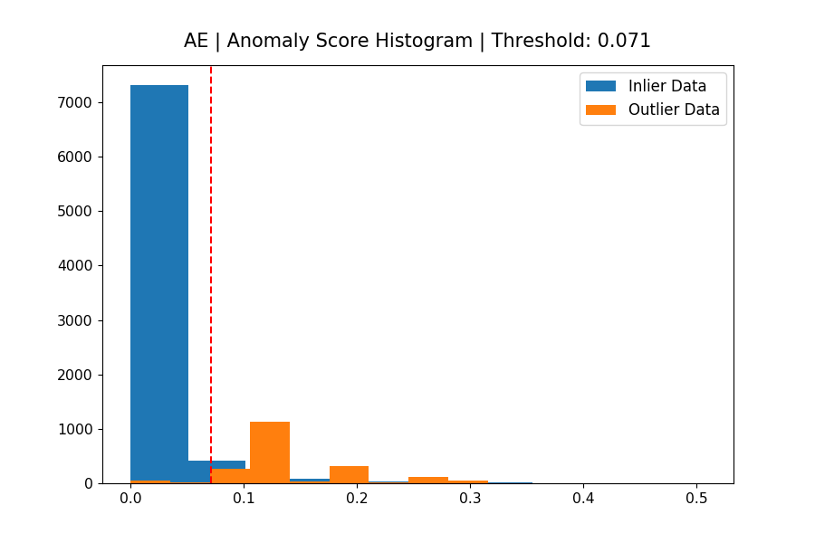
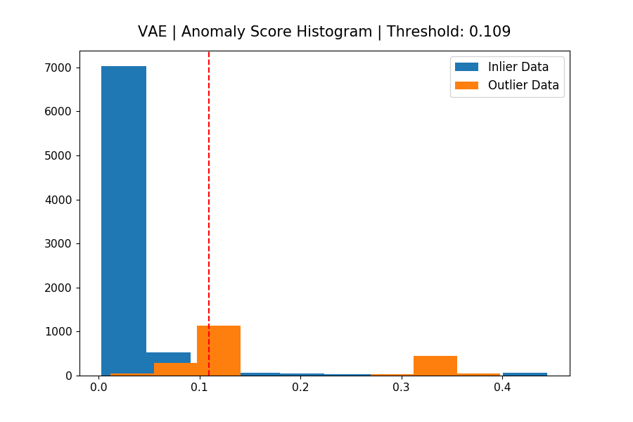
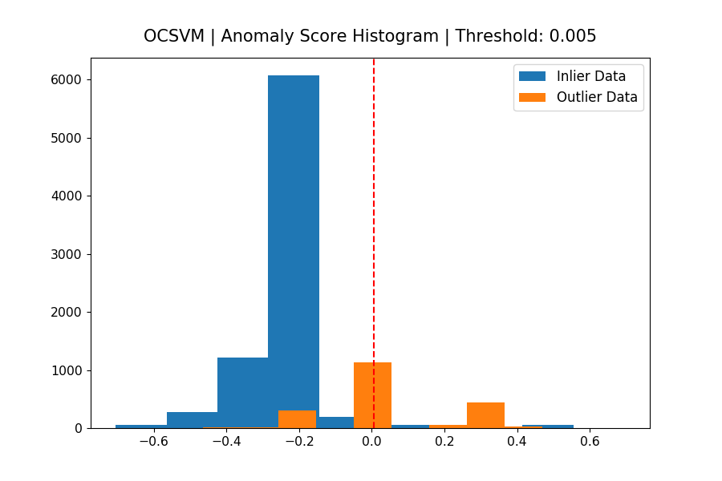
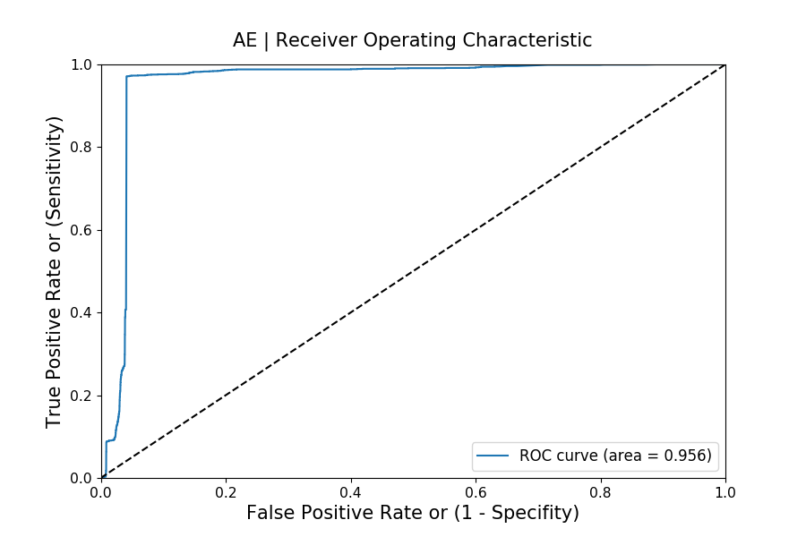
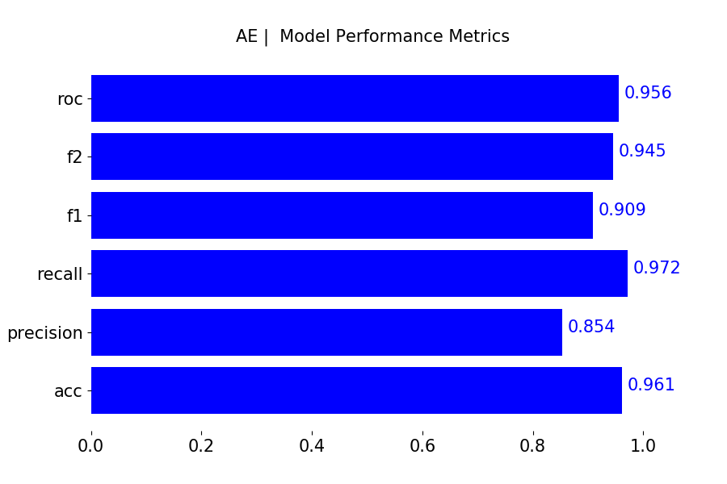
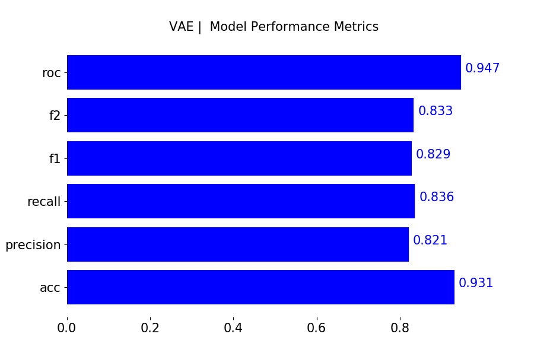
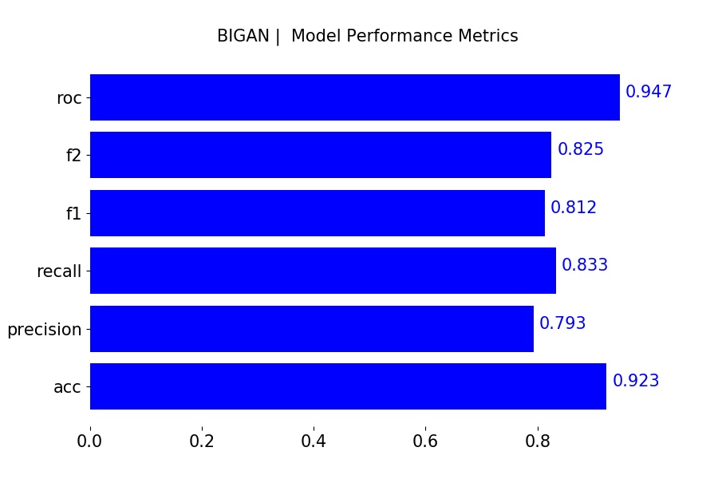
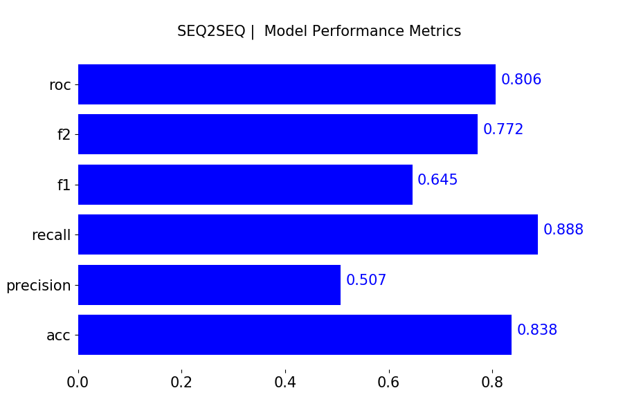
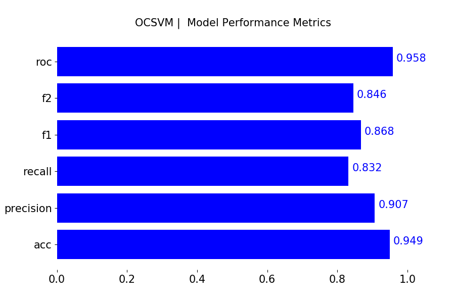
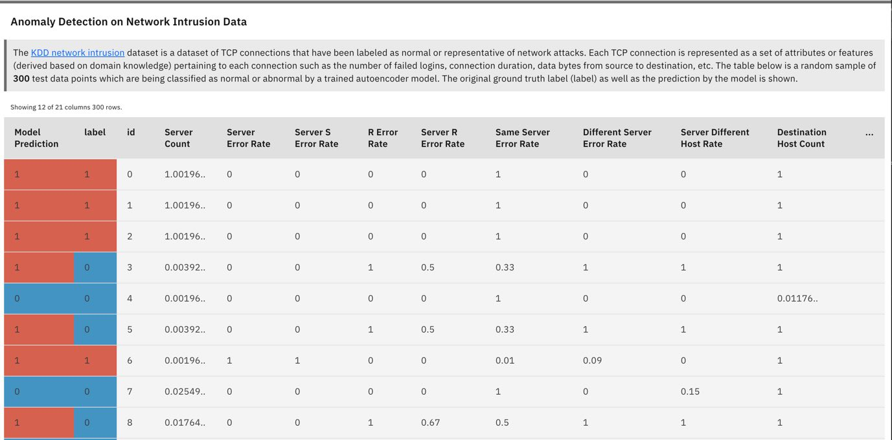

## Deep Learning for Anomaly Detection

|                                    |                                |                                  |
| :--------------------------------: | :----------------------------: | :------------------------------: |
|            AutoEncoder             |    Variational AutoEncoder     |              BiGAN               |
|       |  |  |
|              Seq2Seq               |              PCA               |              OCSVM               |
|  |  |  |

> This repo contains code for experiments we have run at Cloudera Fast Forward for implementing deep learning for anomaly detection use cases.

We include implementations of several neural networks (Autoencoder, Variational Autoencoder, Bidirectional GAN, Sequence Models) in Tensorflow 2.0 and two other baselines (One Class SVM, PCA). We have released a report detailing the technical details for each approach in our online report [here](https://ff12.fastforwardlabs.com/). An interactive visualization of some results can be found [here](http://blip.fastforwardlabs.com/).

Anomalies - often referred to as outliers, abnormalities, rare events, or deviants - are data points or patterns in data that do *not* conform to a notion of normal behavior. Anomaly detection, then, is the task of finding those patterns in data that do not adhere to expected norms, given previous observations. The capability to recognize or detect anomalous behavior can provide highly useful insights across industries. Flagging unusual cases or enacting a planned response when they occur can save businesses time, costs, and customers. Hence, anomaly detection has found diverse applications in a variety of domains, including IT analytics, network intrusion analytics, medical diagnostics, financial fraud protection, manufacturing quality control, marketing and social media analytics, and more.

## How Anomaly Detection Works

The underlying strategy for most approaches to anomaly detection is to first model normal behavior, and then exploit this knowledge to identify deviations (anomalies). In this repo, the process includes the following steps:

- Build a model of normal behavior using available data. Typically the model is trained on normal behavior data or assumes a small amount of abnormal data.
- Based on this model, assign an anomaly score to each data point that represents a measure of deviation from normal behavior. The models in this repo use a _reconstruction_ error approach, where the model attempts to reconstruct a sample at test time, and uses the _reconstruction_ error as an anomaly score. The intuition is that normal samples will be reconstructed with almost no error, while abnormal/unusual samples will be reconstructed with larger error margins.
- Apply a threshold on the anomaly score to determine which samples are anomalies.

As an illustrative example, an autoencoder model is trained on normal samples where the _task_ is to reconstruct the input. At test time, we can use the reconstruction error (mean squared error) for each sample as anomaly scores.

## Structure of Repo

```bash
├── data
│   ├── kdd
│   ├── kdd_data_gen.py
├── cml
├── metrics
├── models
├── utils
├── train.py
├── test.py
```

The `data` directory contains the dataset (kdd network intrusion) used the experiments. It contains a script (`kdd_data_gen.py`) that downloads the data, constructs train and test sets separated into inliers and outliers, and places those data files in the `data/kdd` directory. The `cml` folder contains scripts needed to launch the project on Cloudera Machine Learning (CML). The `models` directory contains code to specify the parameters of each model and methods for training and computing an anomaly score. `train.py` contains code to train each model and then evaluate each model (generate a histogram of anomaly scores assigned by each model, and ROC curve to assess model skill on the anomaly detection task).

`python3 train.py`

This above script does the following:

- Downloads the kdd dataset if not already downloaded
- Trains all of the models (Autoencoder, Variational Autoencoder, Bidirectional GAN, Sequence Models, PCA, OCSVM)
- Evaluates the models on a test split (8000 inliers, 2000 outliers). Generates [charts](metrics) on model performance: histogram of anomaly scores, ROC, general metrics (f1,f2, precision, recall, accuracy)

## Summary of Results

|                              |                          |                            |
| :--------------------------: | :----------------------: | :------------------------: |
|         AutoEncoder          | Variational AutoEncoder  |           BiGAN            |
|       |  |  |
|           Seq2Seq            |           PCA            |           OCSVM            |
|  |  |  |

For each model, we use labeled test data to first select a threshold that yields the best accuracy and then report on metrics such as f1, f2, precision, and recall at that threshold. We also report on ROC (area under the curve) to evaluate the overall skill of each model. Given that the dataset we use is not extremely complex (18 features), we see that most models perform relatively well. Deep models (BiGAN, AE) are more robust (precision, recall, ROC AUC), compared to PCA and OCSVM. The sequence-to-sequence model is not particularly competitive, given the data is not temporal. On a more complex dataset (e.g., images), we expect to see (similar to existing research), more pronounced advantages in using a deep learning model.

For additional details on each model, see our [report](https://ff12.fastforwardlabs.com/). Note that models implemented here are optimized for tabular data. For example, extending this to work with image data will usually require the use of convolutional layers (as opposed to dense layers) within the neural network models to achieve performant results.

|                                  |                              |                                |
| :------------------------------: | :--------------------------: | :----------------------------: |
|           AutoEncoder            |   Variational AutoEncoder    |             BiGAN              |
|       |  |  |
|             Seq2Seq              |             PCA              |             OCSVM              |
|  |  |  |

## How to Decide on a Modeling Approach?

Given the differences between the deep learning methods discussed above (and their variants), it can be challenging to decide on the right model. When data contains sequences with temporal dependencies, a
sequence-to-sequence model (or architectures with _LSTM layers_) can model these relationships well, yielding better results. For scenarios requiring principled estimates of uncertainty, _generative_ models such as a VAE and GAN based approaches are suitable. For scenarios where the data is images, AEs, VAEs and GANs designed with _convolution layers_ are suitable. The following table highlights the pros and cons of the different types of models, to provide guidance on when they are a good fit.

| Model                      | Pros                                                         | Cons                                                         |
| -------------------------- | ------------------------------------------------------------ | ------------------------------------------------------------ |
| AutoEncoder                | <ul><li>Flexible approach to modeling complex non-linear patterns in data</li> | <ul><li>Does not support variational inference (estimates of uncertainty)</li><li>Requires a large dataset for training</li></ul> |
| Variational AutoEncoder    | <ul><li>Supports variational inference (probabilistic measure of uncertainty)</li></ul> | <ul><li>Requires a large amount of training data, training can take a while</li> |
| GAN (BiGAN)                | <ul><li>Supports variational inference (probabilistic measure of uncertainty) </li><li>Use of discriminator signal allows better learning of data manifold [Mihaela Rosca (2018), Issues with [VAEs and GANs, CVPR18](http://efrosgans.eecs.berkeley.edu/CVPR18_slides/VAE_GANS_by_Rosca.pdf)](useful for high dimensional image data).</li><li>GANs trained in semi-supervised learning mode have shown great promise, even with very few labeled data [Raghavendra Chalapathy et al. (2019) "Deep Learning for Anomaly Detection: A Survey"](https://arxiv.org/abs/1901.03407)</li></ul> | <ul><li>Requires a large amount of training data, and longer training time (epochs) to arrive at stable results [Tim Salimans et al. (2016) "Improved Techniques for Training GANs", Neurips 2016](https://arxiv.org/abs/1606.03498)</li><li>Training can be unstable (GAN mode collapse)</li></ul> |
| Sequence-to-Sequence Model | <ul><li>Well suited for data with temporal components (e.g., discretized time series data)</li></ul> | <ul><li>Slow inference (compute scales with sequence length which needs to be fixed)</li><li>Training can be slow</li><li>Limited accuracy when data contains features with no temporal dependence</li><li>Supports variational inference (probabilistic measure of uncertainty)</li></ul> |
| One Class SVM              | <ul><li>Does not require a large amount of data</li><li>Fast to train</li><li>Fast inference time</li></ul> | <ul><li>Limited capacity in capturing complex relationships within data</li><li>Requires careful parameter selection (kernel, nu, gamma) that need to be carefully tuned.</li><li>Does not model a probability distribution, harder to compute estimates of confidence.</li></ul> |

## Deploying on Cloudera Machine Learning (CML)



For users interested in deploying this application on Cloudera Machine Learning, there are three ways to launch the project:

1. **From Prototype Catalog** - Navigate to the Prototype Catalog on a CML workspace, select the "Deep Learning for Anomaly Detection" tile, click "Launch as Project", click "Configure Project"
2. **As ML Prototype** - In a CML workspace, click "New Project", add a Project Name, select "ML Prototype" as the Initial Setup option, copy in the [repo URL](https://github.com/cloudera/CML_AMP_Anomaly_Detection), click "Create Project", click "Configure Project"
3. **Manual Setup** - To begin, create a new project on CML (use the Git tab) and provide the [link](https://github.com/cloudera/CML_AMP_Anomaly_Detection) for this repository. This will clone the repository to your CML workbench session. Launch a Python3 Workbench Session with at least 4GB of memory and run the `cml_build.py` script which will create a CML Application and provide a link to the UI. The build script performs the following steps for you:
   - *Model Training* - this section of the script schedules a CML job which consists of a call to `train.py`. This in turn trains a model and saves the model to the `models/savedmodel` folder.
   - *Model Serving* - this section hosts a model prediction function as a RESTFUL model endpoint. Input to this endpoint is normalized intrusion detection data, and the output is a dictionary of scores and anomaly predictions for each instance in the input data.
   - *Application Serving* - this section hosts a custom web application (shown above) which makes requests to the model endpoint and visualizes results. To run the web application standalone:
     `python3 app/backend/app.py`