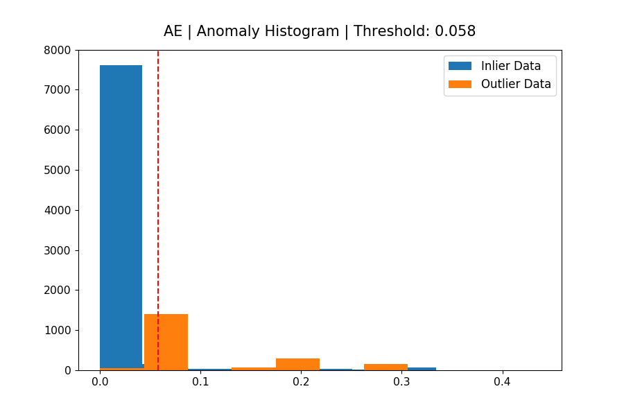
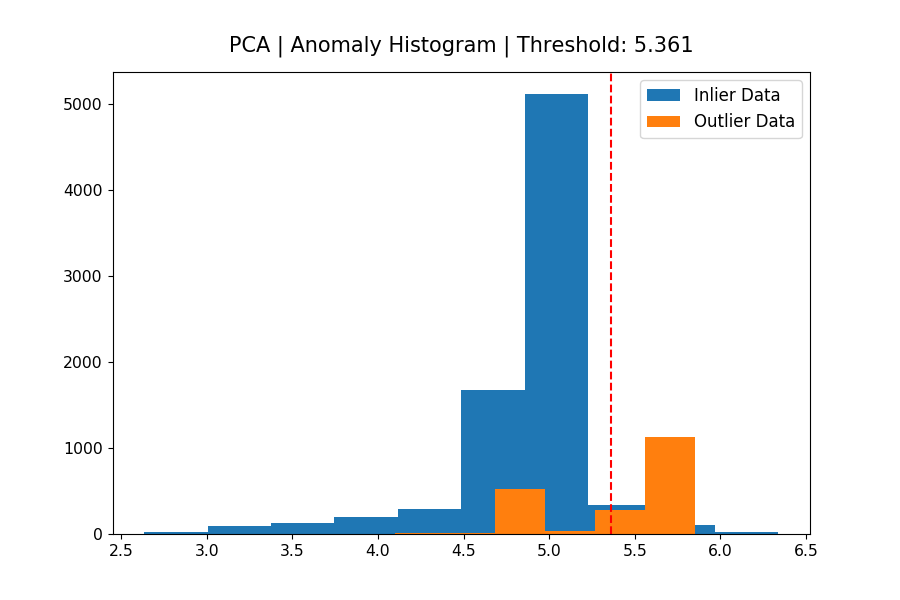
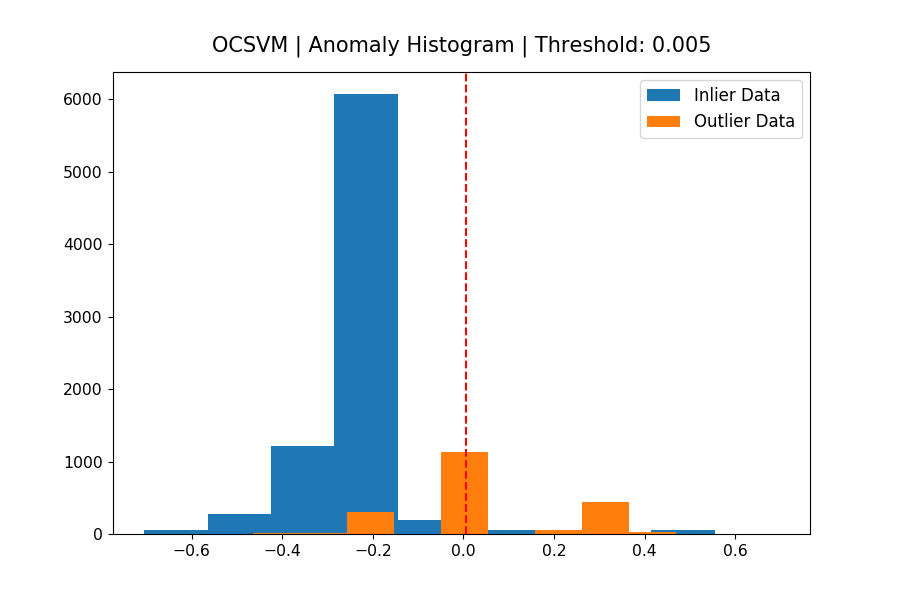
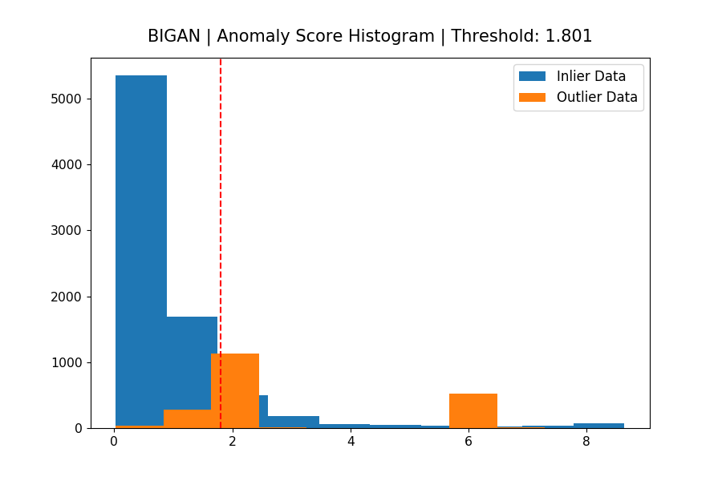
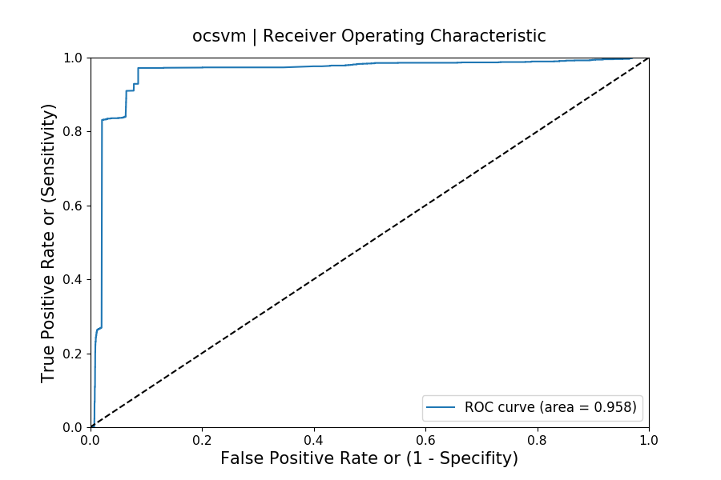
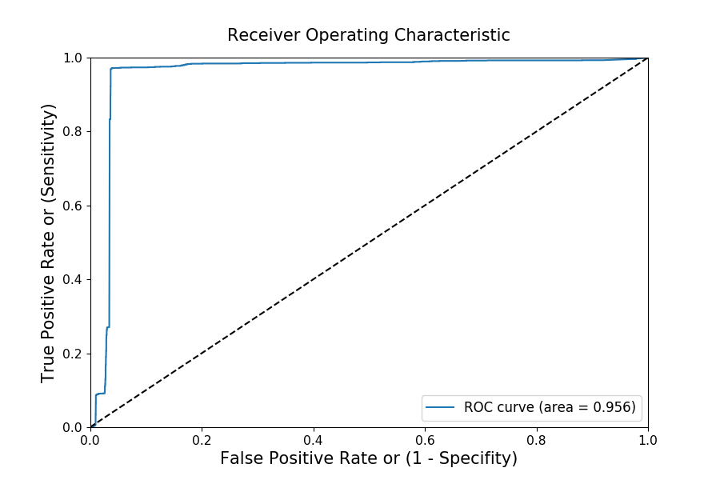
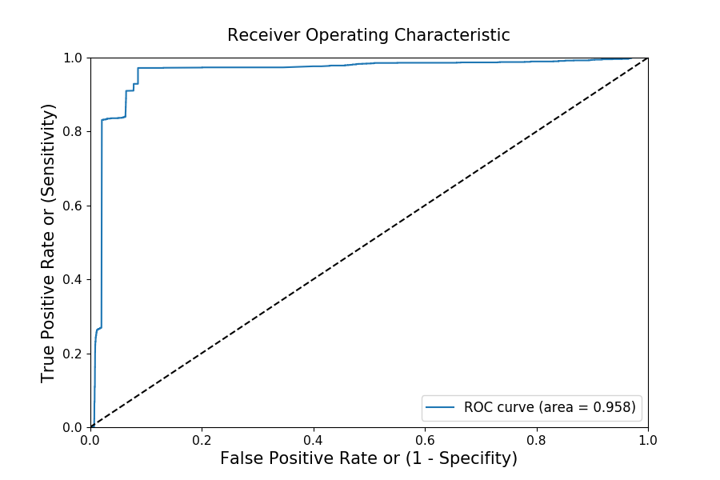
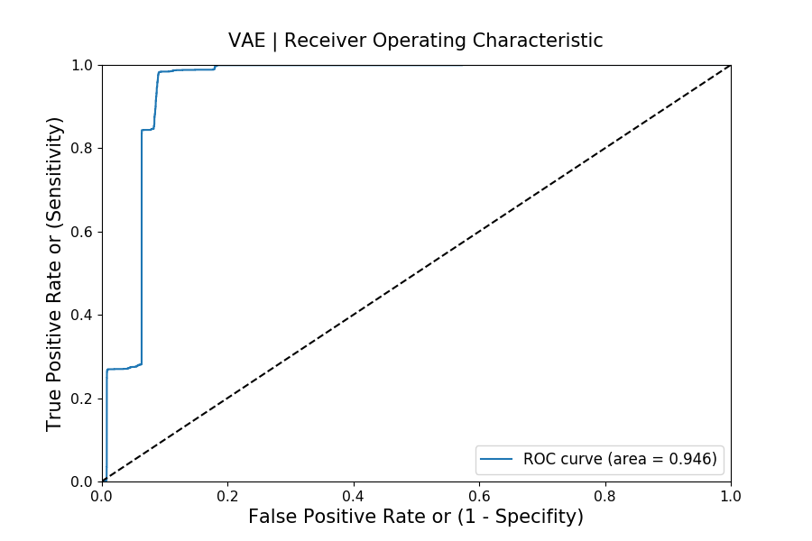
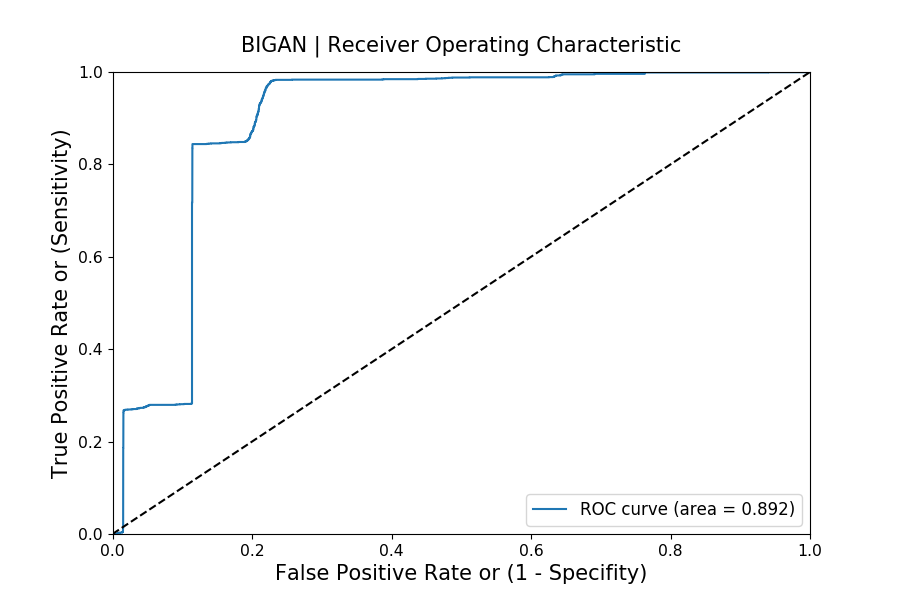

## Deep Learning for Anomaly Detection

<div>



</div>
<div>



</div>

> This repo contains code for experiments we have run at Cloudera Fast Forward for implementing deep learning for anomaly detection usecases. 

We include implementations of several neural networks (Autoencoder, Variational Autoencoder, Bidirectional GAN, Sequence Models) in Tensorflow 2.0 and two other baselines (One Class SVM, PCA). We have released a report detailing the technical details for each approach in our online report [here](https://ff12.fastforwardlabs.com/). An interactive visualization of some results can be found [here](http://blip.fastforwardlabs.com/).

Anomalies, often referred to as outliers, abnormalities, rare events, or deviants, are data points or patterns in data that do not conform to a notion of normal behavior. Anomaly detection, then, is the task of finding those patterns in data that do not adhere to expected norms, given previous observations. The capability to recognize or detect anomalous behavior can provide highly useful insights across industries. Flagging unusual cases or enacting a planned response when they occur can save businesses time, costs, and customers. Hence, anomaly detection has found diverse applications in a variety of domains, including IT analytics, network intrusion analytics, medical diagnostics, financial fraud protection, manufacturing quality control, marketing and social media analytics, and more.

## How Anomaly Detection Works

The underlying strategy for most approaches to anomaly detection is to first model normal behavior, and then exploit this knowledge to identify deviations (anomalies). In this repo, we accomplish this across two steps

- Build a model of normal behavior using available data. Typically the model is trained on normal behaviour data (or assumes a small amount of abnormal data).
- Based on this model, assign an anomaly score  to each data point that represents a measure of deviation from normal behavior. The models in this repo use a _reconstruction_ error approach, where the model attempts to reconstruct a sample at test time, and uses the _reconstruction_ error as an anomaly score. The intuition is that normal samples will be reconstructed with almost no error, while abnormal/unusual samples can be reconstructed with larger error margins.
- Apply a threshold on the anomaly score to determine which samples are anomalies.

As an illustrative example, an autoencoder model is trained on normal samples where the _task_ is to reconstruct the input. At test time, we can use the reconstruction error (mean squared error) for each sample as anomaly scores. 

## Structure of Repo

```bash
├── data
│   ├── kdd
│   │   ├── all.csv
│   │   ├── train.csv
│   │   ├── test.csv
├── models
│   ├── ae  
│   ├── bigan
│   ├── ocsvm
│   ├── vae
├── utils
├── train.py 
```

The `data` directory contains the dataset (kdd network intrusion) used the experiments. It contains a script (`data_gen.py`) that downloads the data and constructs train and test sets separated into inliers and outliers. The `models` directory contains code to specify the parameters of each model and methods for training as well as computing an anomaly score. `train.py` contains code to train each model and then evaluate each model (generate a histogram of anomaly scores assigned by each model, and ROC curve to assess model skill on the anomaly detection task).

`python3 train.py`

This checks for the available datasets (downloads them as needed), trains and evaluates implemented models.

## Summary of Results
<div>



</div>
<div>



</div>

For each model, we use labeled test data to first select a threshold that yields the best accuracy and then report on metrics such as f1, f2, precision, and recall at that threshold. We also report on ROC (area under the curve) to evaluate the overall skill of each model. Given that the dataset we use is not extremely complex (18 features), we see that most models perform relatively well. Deep models (BiGAN, AE) are more robust (precision, recall, ROC AUC), compared to PCA and OCSVM. The sequence-to-sequence model is not particularly competitive, given the data is not temporal. On a more complex dataset (e.g., images), we expect to see (similar to existing research), more pronounced advantages in using a deep learning model.

For additional details on each model, see our [report](https://ff12.fastforwardlabs.com/).

 
## TODO
- Finalize seq2seq train methods
- Map to CML Abstractions
    - Export models from each run for use in CML application
    - CML model/application to host and interact with model endpoint  
- Stretch: Include image dataset.
 
